# VisualML

**See how a text classifier actually works — one stage at a time.**

VisualML is a SwiftUI iOS app that takes a classic text‑classification pipeline
— **Bag‑of‑Words → TF‑IDF → LSA → linear classifier** — and *draws every
intermediate state* so you can watch raw text turn into numbers, into a 2‑D map,
into a decision boundary. Every stage has live knobs: flip a switch and the
heatmap, the scatter, and the accuracy all recompute in front of you.

The running example classifies short documents as **Sport** vs **Business**.

---

## What it does

Most ML tutorials show you the input and the output and hide everything in
between. VisualML makes the middle visible. You start at a home menu, pick a
stage, and drill into the data representation at that point in the pipeline:

| | |
|---|---|
| 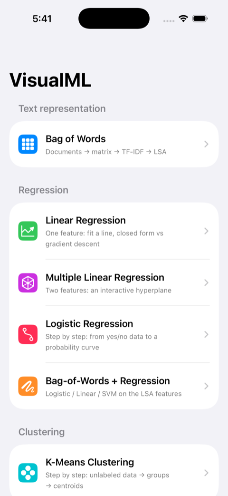 | **Home** — pick a model family: the text‑representation pipeline, the four regression stages, or k‑means clustering. Each opens its own step‑by‑step walkthrough. The greyed‑out rows at the bottom are what's coming next. |
| 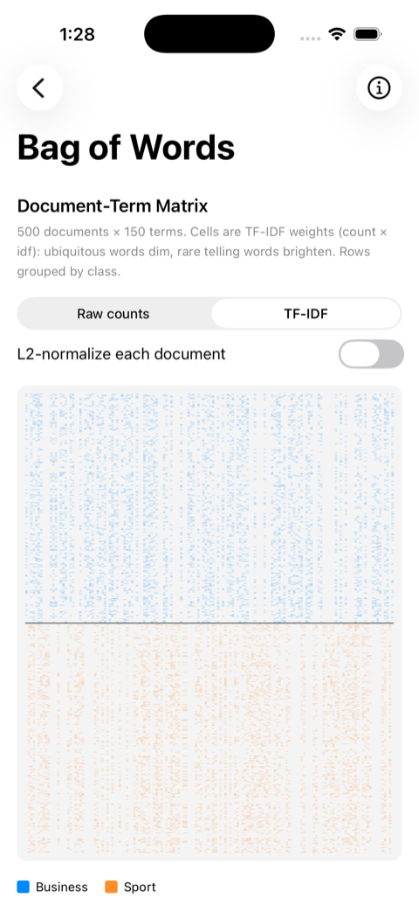 | **Document‑Term Matrix** — 500 documents × 150 terms drawn as a heatmap, one row per document, grouped by class. Toggle **Raw counts ⇄ TF‑IDF** and **L2‑normalize** and watch the cells re‑weight: ubiquitous words dim, rare telling words brighten. |
| 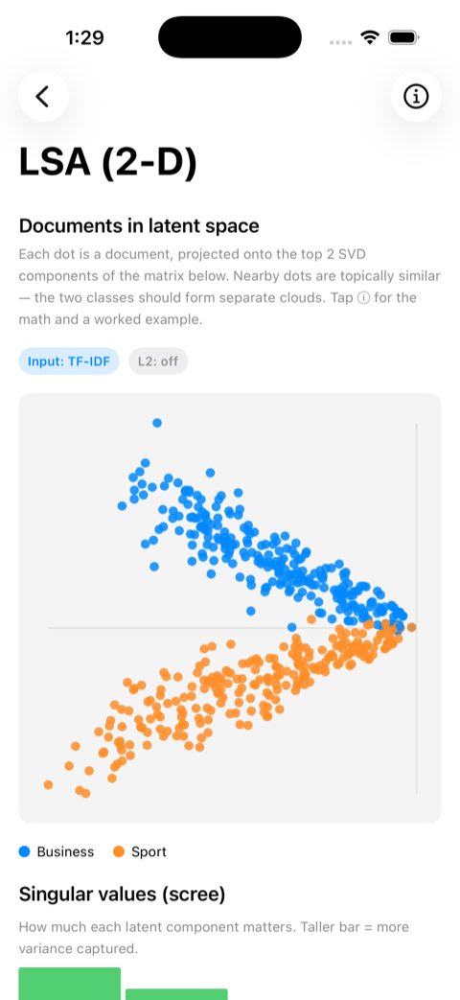 | **LSA projection** — every document compressed to its top‑2 latent components (truncated SVD) and plotted as a point. The documents fan out into two separate arms (a “V”), so the two classes are clearly — and linearly — separable. |
| 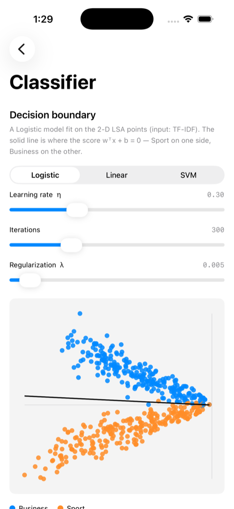 | **Classifier** — fit **Logistic / Linear / SVM** on the 2‑D LSA points and see the decision boundary `wᵀx + b = 0` drawn through the data. Drag the learning‑rate, iterations, and regularization sliders to see the line move. |
| 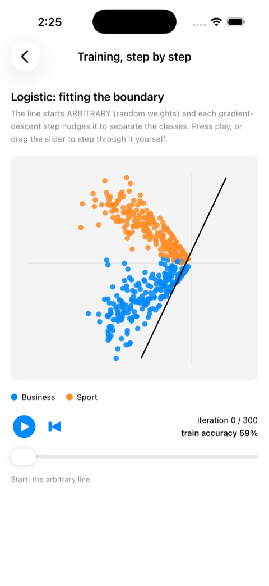 | **Training, step by step** — the boundary starts as an *arbitrary* random line (here: 59% accuracy). Press play or scrub the slider to replay gradient descent iteration‑by‑iteration and watch the line rotate into place as the accuracy climbs. |
| 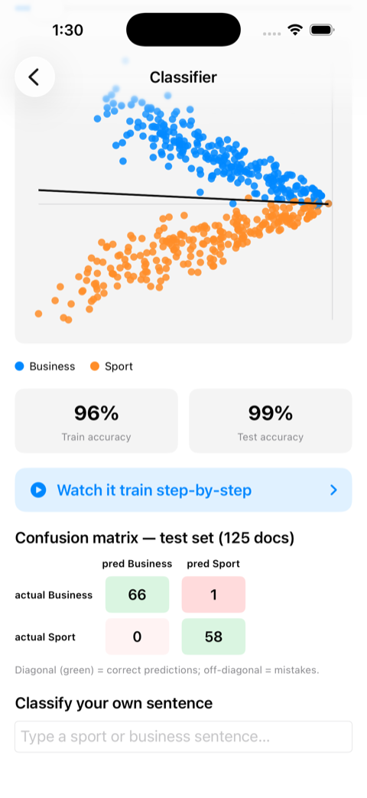 | **Evaluation** — train/test accuracy on a held‑out split and a colour‑coded confusion matrix on documents the model never trained on. |
| 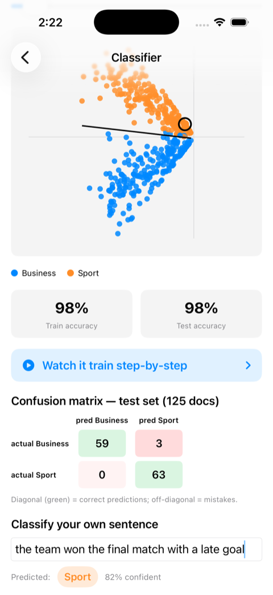 | **Classify your own sentence** — type any sentence and it runs through the *whole* pipeline (tokenize → TF‑IDF → fold into the latent space → apply the boundary). The prediction and confidence appear, and the sentence is dropped onto the scatter as a ringed dot. |

---

## Linear & Logistic Regression

The second half of the app leaves text behind and builds regression from
first principles, on a simulated cohort of students (hours studied, sleep,
and whether they passed). Every number on screen — every coefficient, every
loss value, every point on a curve — is **computed in Python** (hand‑written
NumPy; pandas only reads the CSV, scikit‑learn is used solely to split
train/test) and shipped into the app as JSON. SwiftUI does no fitting of its
own — it replays what Python already solved, which is what makes the
sliders and the training playback feel live without a Python runtime on the
phone.

**Linear regression** predicts a *continuous* exam score from hours studied.
It is fit two ways side by side — an exact **closed‑form** solution (the
normal equations, solved in one step) and iterative **gradient descent** —
so you can watch the iterative fit walk onto the exact answer and see
exactly where a too‑large learning rate diverges.

| | |
|---|---|
| 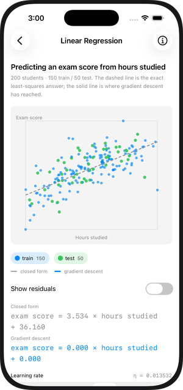 | **The fit** — train/test points, the closed‑form line (dashed) against the live gradient‑descent line (solid), with a toggle for the residuals. |
| 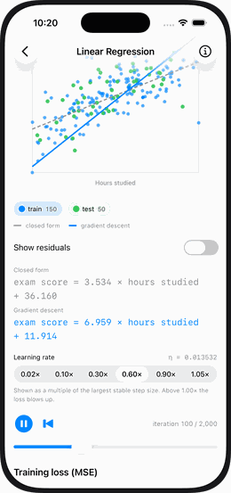 | **Watching it converge** — press play and gradient descent rotates the line, iteration by iteration, onto the closed‑form answer. The learning‑rate picker is shown as a multiple of the largest stable step size, so picking a rate above 1.00× visibly diverges. |
| 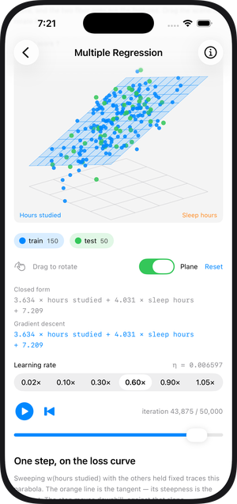 | **Multiple regression** — add a second feature (sleep) and the fit becomes a plane through a 3‑D cloud instead of a line through 2‑D points. Drag to rotate it and watch R² improve over the single‑feature model. |

**Logistic regression** predicts a *yes/no* outcome (did the student pass?)
and is built as a four‑step walkthrough rather than a single screen, so the
transformation from raw data to decision is never taken on faith:

| | |
|---|---|
| 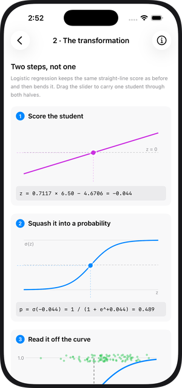 | **1 · Score, then squash** — a student's hours are first turned into an unbounded score `z = w·x + b`, then squashed through the sigmoid into a 0–1 probability. Both stages are drawn, with the arithmetic spelled out at every step. |
| 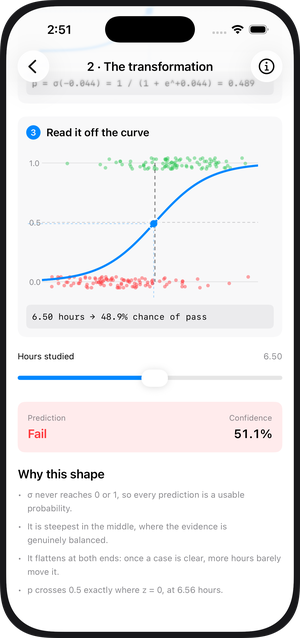 | **2 · The fitted curve** — the sigmoid drawn directly over the training data, with the decision boundary (p = 0.5) marked and a slider to drag any student's hours through the model live. |
| 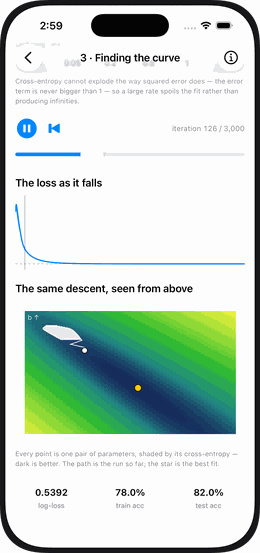 | **3 · Finding the curve** — gradient descent on the cross‑entropy loss, shown two ways at once: the S‑curve bending into place over the data, and the same descent traced as a path across the loss landscape (dark = low loss). |

Logistic regression has **no closed form** — unlike the linear stage there
is no exact line to check gradient descent against, which the app calls out
explicitly, along with why cross‑entropy (not squared error) is the right
loss for a 0/1 target, and how to read the fitted weight as an **odds
ratio**. A fourth step lets you drag the decision threshold and watch
precision and recall trade off in the confusion matrix in real time.

Every regression screen has an ⓘ button opening a maths sheet — the normal
equations, the gradient derivation, the loss‑surface geometry, and worked
examples using the exact numbers the app shows — plus a sortable data table
of every row behind the fit.

---

## K‑Means Clustering

Every stage above had a target to predict. Clustering has none: the input is
180 simulated customers described only by **annual spend** and **visit
frequency**, and the task is to find the groups hiding in the numbers.
As with the regression stages, all the mathematics runs in Python
(hand‑written NumPy — scikit‑learn appears only as a cross‑check oracle) and
the app replays the exported result.

| | |
|---|---|
| 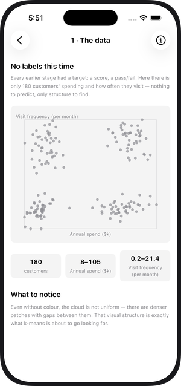 | **1 · The data** — the dataset drawn with no colour at all, because there are no labels to colour by. Even so the cloud is visibly lumpy: denser patches with gaps between them. That structure is what the algorithm goes looking for. |
| 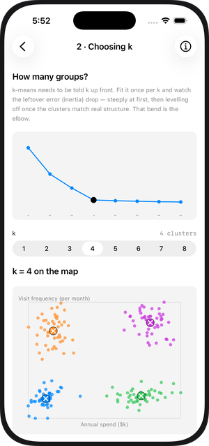 | **2 · Choosing k** — k has to be chosen up front, and inertia always falls as k grows, so the lowest score is never the answer. The elbow curve shows where extra clusters stop paying for themselves; the picker refits the map live at every k from 1 to 8, so you can watch k=2 merge real groups and k=7 split them. |
| 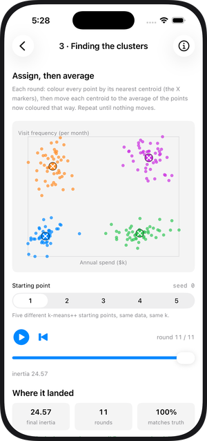 | **3 · Finding the clusters** — the assign‑then‑average loop, played back round by round with the centroids visibly migrating and inertia falling. Five different k‑means++ starting points are provided: four converge to the same answer, and one gets stuck in a worse one — kept deliberately, because k‑means only ever finds *a* local optimum. |
| 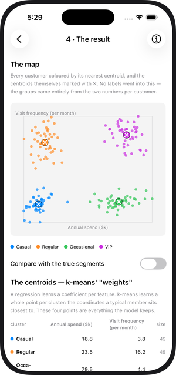 | **4 · The result** — the finished map, plus the four centroids listed in real units ($k spent, visits/month). Those centroids **are** the model: where a regression keeps coefficients, k‑means keeps one point per cluster. A toggle compares the discovered groups against the segments the data was generated from. |

The clusters recovered here match the true generating segments **100%**, and
the best‑of‑restarts inertia agrees with scikit‑learn’s `KMeans` exactly
(24.5683 from both). The ⓘ sheet covers why the features are standardized
before any distance is measured, how k‑means++ seeds itself, why the
assign/update loop can never increase inertia, and what the algorithm quietly
assumes about cluster shape.

---

## Topics covered so far

The app is a working tour of a full classical‑NLP classification stack:

**Text → numbers**
- **Tokenization & vocabulary building** (with optional stop‑word removal and a min‑document‑frequency / max‑vocabulary cap)
- **Bag‑of‑Words** — the document‑term count matrix
- **TF‑IDF weighting** — `idf = ln((1 + D) / (1 + df)) + 1`, multiplied into the counts to down‑weight common words and up‑weight discriminative ones
- **L2 normalization** — scaling each document vector to unit length so document length stops dominating

**Dimensionality reduction**
- **Latent Semantic Analysis (LSA)** = **truncated SVD** of the weighted matrix
- Computed via the **Gram matrix** `G = W·Wᵀ` and **power iteration with deflation** (`G·v = W·(Wᵀ·v)`), so it scales to the full 500‑document set without a heavy linear‑algebra dependency
- **Document coordinates** `U·Σ`, **term loadings** `Wᵀ·U / σ`, a **scree plot** of the singular values, and **folding‑in** to project a brand‑new sentence into the existing latent space

**Classification**
- **Logistic Regression** — sigmoid + cross‑entropy loss
- **Linear Regression as a classifier** — least‑squares to {0, 1} with a 0.5 threshold, kept deliberately as a *contrast* to logistic regression
- **Linear SVM** — hinge loss with a sub‑gradient update and visible ±1 margins
- **Gradient descent** with adjustable learning rate, iteration count, and L2 regularization
- **Feature standardization** before fitting

**Evaluation**
- **Seeded train/test split**
- **Accuracy**, **confusion matrix**, and a live **decision boundary**

**Linear regression**
- **Closed‑form least squares** — the normal equations `XᵀXθ = Xᵀy`, with the
  bias folded into `θ` via a design matrix, solved directly with no iteration
- **Batch gradient descent** on the same design matrix, swept across a
  learning‑rate ladder expressed as a fraction of the largest stable step size
- **Multiple regression** — a second feature turns the fit from a line into a
  plane, with a hand‑written 3‑D projection (yaw/pitch, painter's‑algorithm
  depth sorting) to draw and rotate it
- **R², RMSE, residuals**, and a train/test split evaluated throughout training

**Logistic regression**
- **Sigmoid squashing** `p = σ(w·x + b)` of an unbounded linear score into a
  0–1 probability, contrasted directly against a least‑squares line that
  predicts nonsensical values outside [0, 1]
- **Binary cross‑entropy** loss and its gradient `(1/n)·Xᵀ(p − y)` — the same
  "error × input" shape as linear regression's gradient, despite a different
  model and a different loss
- **No closed form** — gradient descent is the only solver, which the app
  states and explains rather than glossing over
- **Odds ratios** (`e^w`), a movable **decision threshold**, and a live
  **precision/recall** trade‑off alongside the confusion matrix

**Clustering (unsupervised)**
- **K‑means** — the assign‑then‑average loop, with the proof sketch for why
  neither step can ever increase inertia, so the loop always settles
- **Inertia** `Σ ‖x − centroid(x)‖²` as the objective, and the **elbow method**
  for choosing k when lower inertia is always available by raising k
- **k‑means++ initialization** — seeding centroids proportionally to squared
  distance from those already chosen, and **restarts** to escape the local
  optima plain k‑means can get trapped in
- **Feature standardization**, without which the larger‑range feature
  dominates every distance

---

## Requirements

- **macOS** with **Xcode** (an SDK that supports **iOS 26.5**)
- An **iPhone 17 Pro** simulator (or any iOS 26.5 simulator / device)
- No third‑party packages — the app uses only **SwiftUI** and the standard library. The matrix/SVD math is hand‑written, so there’s nothing to install.

> The dataset and every regression result ship pre‑generated in the repo
> (`Models/*.csv`, `Models/*.json`), so the app runs fully offline with no
> setup. **Python 3.10+** (`numpy`, `pandas`, `scikit‑learn`) is only needed
> if you want to regenerate the data or re‑run the regression fits yourself
> — see [`ml/`](ml).

---

## Getting started

```bash
git clone <your-repo-url>
cd VisualML
open VisualML.xcodeproj
```

Then in Xcode:

1. Select the **VisualML** scheme and an **iPhone 17 Pro** simulator.
2. Press **▶ Run** (`⌘R`).
3. From the home screen, tap **Bag of Words** to walk the text pipeline,
   **Linear Regression** / **Multiple Linear Regression** / **Logistic
   Regression** for the regression stages, or **Bag‑of‑Words + Regression**
   to jump straight to the text classifier.

---

## How it’s built

The app follows **MVVM**. A single `PipelineViewModel` owns the configuration
and caches each artifact; changing a knob recomputes only what depends on it
(a vocabulary change rebuilds everything; a weighting change re‑runs LSA; a
classifier knob just retrains). The heavy LSA compute runs **off the main
thread** and is cached. All the heatmaps and scatter plots are drawn with
SwiftUI `Canvas`.

The regression stages follow a different split: **all fitting happens in
Python**, offline, and the app only decodes and draws the JSON it produces
— there is no `ViewModel` retraining anything on device.

```
VisualML/
├─ ml/                         // Python: the regression math (not bundled into the app)
│  ├─ common.py                // closed form, gradient descent, sigmoid, cross-entropy
│  ├─ generate_data.py         // simulates the student cohort
│  ├─ make_linear.py           // fits + exports linear_regression(.json | _multi.json)
│  ├─ make_logistic.py         // fits + exports logistic_regression.json
│  ├─ generate_cluster_data.py // simulates the customer cohort
│  ├─ kmeans.py                // k-means++, assign/update loop, inertia
│  └─ make_kmeans.py           // fits + exports kmeans.json
├─ Models/
│  ├─ DataPoint.swift          // one labelled document
│  ├─ PipelineModels.swift     // config + every intermediate type (matrix, SVD result, …)
│  ├─ dataset.csv              // 500 docs (250 sport / 250 business)
│  └─ *.json                   // precomputed regression fits (bundled resources)
├─ Services/
│  ├─ DataSetLoader.swift      // CSV parser
│  ├─ NLPProcessor.swift       // tokenize → vocabulary → document-term matrix
│  ├─ Weighting.swift          // TF-IDF + L2 normalization
│  ├─ MatrixMath.swift         // truncated SVD via power iteration + deflation
│  ├─ Classifier.swift         // logistic / linear / SVM gradient descent (text classifier)
│  ├─ RegressionExport.swift   // Codable models for the linear-regression JSON
│  ├─ LogisticExport.swift     // Codable models for the logistic-regression JSON
│  └─ ClusterExport.swift      // Codable models for the k-means JSON
├─ ViewModels/
│  └─ PipelineViewModel.swift  // holds config + cached artifacts (MVVM, text pipeline only)
└─ Views/
   ├─ HomeView.swift           // root menu
   ├─ BagOfWordsFlowView.swift // stage navigation (dataset → matrix → LSA)
   ├─ DatasetView.swift        // the labelled documents
   ├─ MatrixHeatmapView.swift  // the document-term heatmap
   ├─ LSAView.swift            // 2-D latent-space scatter + scree plot
   ├─ ClassifierView.swift     // decision boundary + metrics + live classify
   ├─ TrainingView.swift       // step-by-step gradient-descent playback (text classifier)
   ├─ LinearRegressionView.swift    // closed form vs gradient descent, one feature
   ├─ RegressionPlaneView.swift     // multiple regression: rotatable 3-D hyperplane
   ├─ RegressionInfoSheet.swift     // linear-regression maths sheet
   ├─ RegressionDataTableView.swift // sortable table behind either linear fit
   ├─ LossParabolaView.swift        // the tangent-on-a-parabola gradient-step explainer
   ├─ LogisticFlowView.swift        // 4-step logistic stage menu
   ├─ LogisticDataView.swift        // step 1 — the data, and why a line fails
   ├─ LogisticSigmoidView.swift     // step 2 — score, then squash
   ├─ LogisticTrainingView.swift    // step 3 — training playback + loss landscape
   ├─ LogisticDecisionView.swift    // step 4 — movable threshold + confusion matrix
   ├─ LogisticInfoSheet.swift       // logistic-regression maths sheet
   ├─ KMeansFlowView.swift          // 4-step clustering stage menu
   ├─ ClusterMapView.swift          // shared scatter: points + centroids
   ├─ KMeansDataView.swift          // step 1 — the unlabeled data
   ├─ KMeansElbowView.swift         // step 2 — elbow curve + live k picker
   ├─ KMeansTrainingView.swift      // step 3 — assign/average playback
   ├─ KMeansResultView.swift        // step 4 — final map + centroid table
   ├─ KMeansInfoSheet.swift         // k-means maths sheet
   └─ …Info sheets, layout helpers
```

---

## Dataset

`Models/dataset.csv` holds **500 generated documents** (250 sport, 250 business),
two columns: `category,text`. The vocabulary is capped at 150 terms. Document
lengths vary widely on purpose — short documents land near the origin of the LSA
plot while long ones fan outward, which is what gives the 2‑D projection its
characteristic spread and makes the structure easy to see.

---

## Roadmap

The home screen already lists what’s next — each gets the same
“visualize every intermediate state” treatment:

- **Neural network** — forward pass and backpropagation drawn layer by layer,
  with every activation function (and its derivative) visualized
- **Transformer architecture** — the longer-term goal
